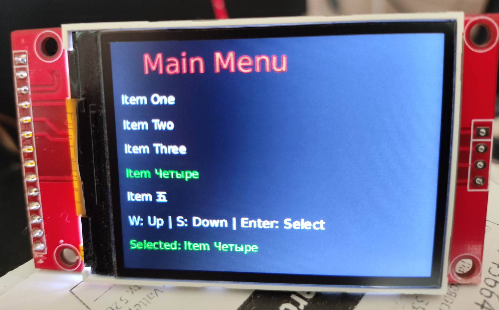

# Slint framebuffer example

## What is this?

This example contains a very simple Slint [Platform](https://docs.rs/slint/latest/slint/platform/trait.Platform.html) implementation that renders to a Linux framebuffer device.

Slint is a UI library written in Rust. Learn more about it at https://slint.dev

The example uses single-buffered rendering (double-buffer would be supported by the framebuffer API, however it's not supported by all drivers - especially the `fbtft` driver [does not support it](https://github.com/notro/fbtft/issues/401)).

## Features

- **32-bit framebuffer support**: Automatically detects and handles both 16-bit (RGB565) and 32-bit (RGB888/RGBA) framebuffers
- **Keyboard input**: Reads events from `/dev/input/event0` for keyboard navigation
- **Cross-compilation**: Supports building for ARMv7 32-bit targets

## Keyboard Controls

Keyboard input is read from `/dev/input/event0`. The following keys are supported:

| Action | Key Codes |
|--------|-----------|
| Up | 103 (Arrow Up), 25 (W), 17 |
| Down | 108 (Arrow Down), 16 (S), 31 |
| Select | 28 (Enter) |

To find the key codes for your keyboard, run the application and check the debug output:
```
KEY: code=<N> value=1
```

## How to use

1. Open `main.rs` and make sure the `tty_path`, `fb_path`, and keyboard device path match your system.
2. Compile & run, with `cargo run`

## Cross-Compiling for ARMv7

See [doc/cross-compile-guide.md](doc/cross-compile-guide.md) for detailed instructions on cross-compiling for ARMv7 32-bit Linux targets.

## Why?

I wanted to see how adding a custom platform implementation works (the process went very smoothly, thanks to [excellent upstream documentation](https://docs.rs/slint/latest/slint/docs/mcu/index.html))

## Tested Hardware

Tested on Raspberry Pi 2W with [fbcp-ili9341](https://github.com/juj/fbcp-ili9341) and SPI ST7789 TFT display.
OS: Raspbian 1:6.12.75-1+rpt1~bookworm (2026-03-11) armv7l GNU/Linux


